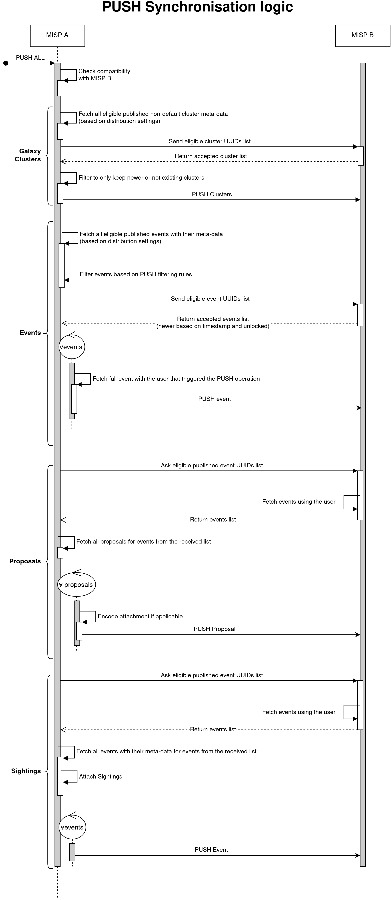
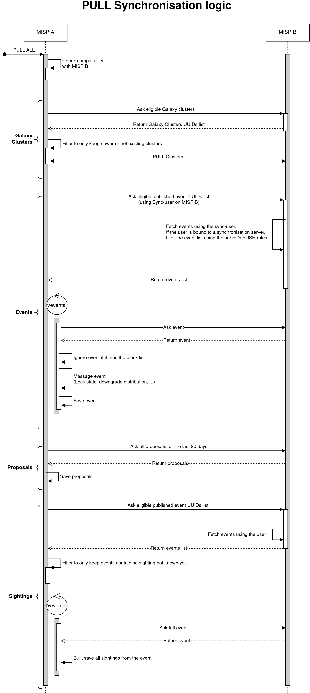

# Data visibility for Sync-users

Sync-users are used to serve as the point of connection between instances.
Typically, events pushed to an instance are created via a sync-user account residing on the remote instance.
Events pulled from an instance are fetched using the remote's sync user account and are then saved locally.

If a sync-user is bound to a synchronisation server, the event index might be filtered based on the PUSH rules defined in the synchronisation server settings.
The binding can be set when editing a user by linking it to an existing synchronisation server.

## Standard server connection without filtering rules

### State
- User Role = `perm_sync`
- `MISP.unpublishedprivate` = false
    - True will deny access to unpublished events to users outside the organization of the submitter except site admins.


### Conditions
- `cond_org`: Does the event belong to the requesting user's org
- `cond_unpublished_private`: Should unpublished events be hidden for users outside the event's organisation
- `cond_distribution`: Does the event's distribution level allows it to be view by the requesting user

Where `cond_distribution` is as follow:
```
Event.distribution ∈ [1, 2, 3] ∨ (Event.distribution = 4 ∧ User ∈ Event.sharing_group_id)
```
Or expressed otherwise:
- The distribution level of the event must either be `This community only`, `Connected community` or `All communities`.
- Or, if the distribution level is set to `sharing group`, the user requesting the event must be part of said sharing group

Events are retrieved from the database if the following condition is met:
```
cond_org ∨ (cond_distribution ∧ cond_unpublished_private)
```
Or expressed otherwise:
- The event belongs to the user requesting the event
- Or, the user is authorised to view the event considering its distribution level and its publication state


## Server connection with PUSH filtering rules

### State
- User Role = `perm_sync`
- `MISP.unpublishedprivate` = false // True will deny access to unpublished events to users outside the organization of the submitter except site admins.
- Server has PUSH rule(s)
    - e.g.: Events with the tag `exportable` are allowed


### Conditions
- `cond_org`: Does the event belong to the requesting user's org
- `cond_unpublished_private`: Should unpublished events be hidden for users outside the event's organisation
- `cond_distribution`: Does the event's distribution level allows it to be view by the requesting user
- `cond_push_rule`: Any events to be pushed must satisfy this condition

Where `cond_distribution` is as follow:
```
Event.distribution ∈ [1, 2, 3] ∨ (Event.distribution = 4 ∧ User ∈ Event.sharing_group_id)
```
Which is the same as in the previous example.

Events are retrieved from the database if the following condition is met:
```
( cond_org ∨ (cond_distribution ∧ cond_unpublished_private) ) ∧ cond_push_rule
```
Which is almost the same as in the previous example.
The only difference is that the previous conditions must be fulfilled and the `push_rule` described in the synchronisation link must be met.

## Synchronisation logic



